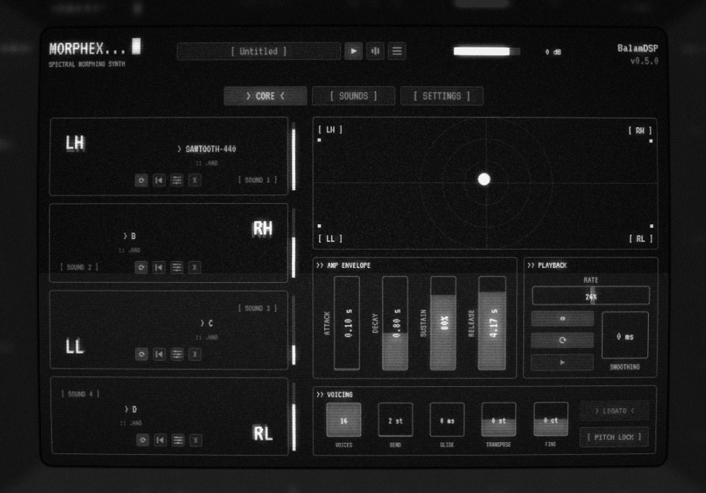

# Morphex — Four-Way Morphing Synth

A VST3 / Standalone spectral morphing instrument by **BalamDSP**.
Loads four HPS-analyzed sounds and morphs between them on an XY pad, with
a residual/transient layer and a built-in analysis window.

Formats: **VST3**, **AU** (macOS), **CLAP** + **Standalone** (JUCE 9, CMake).

<p align="center">
  
</p>

## Features

### Morph engine
- **Four-corner bilinear morph** over HPS analysis data (`.had`: harmonic
  partials plus residual/stochastic envelopes).
- **Independent per-property blends** — pitch, loudness and brightness each
  follow their own morph position, plus a **Cross mode** (pitch from one
  corner, loudness from another), per-slot **formant shift** and post-glide
  **morph trims**.
- **Independent per-slot playheads** — rate, offset, loop window, direction
  and loop/one-shot per corner; reverse playback, ping-pong and
  forward-only supported, plus −400..+400% time-scrub.
- **Transpose / fine tune**, glide, legato, pitch bend and 1–16 voices.

### Analysis window
- Drop in audio and get analyzed partials: source and
  resynthesis waveforms, partials map with f0 line, region-scoped analysis
  and A/B comparison playback.

### Interface
- Fixed CRT panel with a toggleable **CRT overlay** based on cool-retro-term.

## Building

Requirements: CMake ≥ 3.22 and a C++17 compiler. JUCE 9.0.1 is fetched
automatically via CMake's FetchContent.

1. Configure and build:

   ```sh
   cmake -B build
   cmake --build build --config Release
   ```

2. Artifacts land in `build/Morphex_artefacts/`:
   - `VST3/Morphex.vst3`
   - `AU/Morphex.component` (macOS only)
   - `CLAP/Morphex.clap`
   - `Standalone/Morphex` (`.exe` on Windows, `.app` on macOS)

   When `MORPHEX_COPY_AFTER_BUILD` is ON (the default) plugins are also
   copied into the platform's default system plugin folders.

## Third-party

| Component | Author | License |
|---|---|---|
| JUCE framework | JUCE Ltd | AGPLv3 |
| clap-juce-extensions | free-audio | MIT |
| SMS tools | MTG-UPF | AGPLv3 |
| [Original Morphex](github.com/MarcSM/morphex) | Marc Sanchez Martinez | GPLv3 |
| Vutu | Madrona Labs | GPLv3 |
| cool-retro-term | Filippo Scognamiglio (Swordfish90) | GPL |
| VT323 typeface | Peter Hull | OFL |

## License

Morphex — Copyright (C) 2026 BalamDSP

This program is free software: you can redistribute it and/or modify it under
the terms of the GNU Affero General Public License as published by the Free
Software Foundation, either version 3 of the License, or (at your option) any
later version.

This program is distributed in the hope that it will be useful, but WITHOUT
ANY WARRANTY; without even the implied warranty of MERCHANTABILITY or FITNESS
FOR A PARTICULAR PURPOSE. See the GNU Affero General Public License for more
details. The full text is in [LICENSE](LICENSE) and at
<https://www.gnu.org/licenses/>.

Third-party components remain under their own licenses (table above).
Original Morphex component files retain their GPLv3 notices; GPLv3 and
AGPLv3 are compatible.
